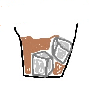

<!-- Improved compatibility of back to top link -->

<!-- PROJECT LOGO -->
 

  

<h3 align="center">Mortgage Manager</h3>

  

    This is a console app written in Python that enables the user to manage mortgage calculations and products. 
     
    <a href="https://github.com/whiskey-neat/mortgage-manager"><strong>Explore the docs »</strong></a>
     
     
    <a href="https://github.com/whiskey-neat/mortgage-manager">View Demo</a>
    ·
    <a href="https://github.com/whiskey-neat/mortgage-manager/issues">Report Bug</a>
    ·
    <a href="https://github.com/whiskey-neat/mortgage-manager/issues">Request Feature</a>
  

<!-- TABLE OF CONTENTS -->

  
Table of Contents

  <ol>
    <li><a href="#about-the-project">About The Project</a></li>
    <li><a href="#progress">Progress</a></li>
    <li><a href="#contact">Contact</a></li>
  </ol>

<!-- ABOUT THE PROJECT -->
## About The Project

[![Product Name Screen Shot][product-screenshot]](https://example.com)

This is a university project for my Programming Fundamentals module.

I have created a console based app used to perform basic mortgage maintenance needs such as managing products and
quotes.

(<a href="#readme-top">back to top</a>)

<!-- Progress -->

## 📈 Roadmap & Progress

### ✅ Main Menu Requirements (15 Marks)

- ✔ The application should start with a list of main menu items

- ✔Prompt the user to input a number and validate the input against
  - non-integer values
  - alpha characters
  - 1 <= input <= 3

- ✔ The application will go to respective menu

- ✔ The application will exit upon selection of Option 3

### ✅ Manage Mortgage Products Requirements (35 Marks)

- ✔ Display the "Manage Mortgage Products" submenu (3 Marks)
- ✔ **Create Product**:
  - ✔ Allow the user to create a product requiring the following fields:
    - Product Name
    - Interest Rate
    - These fields should be stored in a list
  - ✔ Display a "Product Summary" of the product before creation:
  - ✔ Ask for user input:
    - ✔ _key_1_ : Continue with Creation
    - ✔ _any key_ : Quit
- ✔ **List Products**: (5 Marks)
  - ✔ Display a list of products available in the application
  - ✔ _key_enter_ to go back to main menu of "Manage Products"
- ✔ **Amend Products**:
  - ✔ Display a list of products and prompt user to select one
  - ✔ Allow user to amend values for the following fields:
    - Product Name
    - Product Interest Rate
    - Allow user to escape from amending fields using _key_q or key_Q_
  - ✔ Display an amended summary
- ✔ **Delete Products:**
  - ✔ Display a list of products and prompt the user to select one or _escape_
  - ✔ Ask the user to confirm deletion of product
- ✔ Return to Main Menu (1 Mark)

### ✅ Manage Mortgage Quotes Requirements (30 Marks)

- ✔ Display the "Manage Mortgage Quotes" submenu (4 Marks)
- ✔ **Create Quote**: (8 Marks)
  - Allow the user to create a quote requiring the following fields:
    - Customer Name
    - Loan Amount
    - Term of Loan in Years
    - Product
  - Save the record in a list
- ✔ **List Quotes**
  - ✔ Displays a list of exisiting quotes (8 Marks)
  - ✔ If there are no quotes then display the following message:
    - "No quotes have been set up"
  - ✔ Press enter to return to Manage Quotes Menu (1 Mark)
- ✔ **Amend Quotes**
  - ✔ Display a list of quotes and prompt the user to select one
- ✔ Return to Main Menu (1 Mark)

### ✅ Video Recording (20 Marks)

- 📌 No more than 7 minutes long
- 📌 With Voice
- 📌 Made with Panopto

#### Content:

- ✔ Workable application demonstrating all requirements
- ✔ A brief explanation of the program code at the **end** of the video
- ✔ Explain the source code that is causing errors and interupting the flow of the demonstration

See the [open issues](https://github.com/whiskey-neat/mortgage-manager/issues) for a full list of proposed features (and known issues).

(<a href="#readme-top">back to top</a>)

<!-- CONTACT -->

## 📢 Contact

Chloe Rowe

Come connect with me on [LinkedIn!](https://uk.linkedin.com/in/chloe-rowe-cyber)

Project Link: [whiskey-neat/mortgage-manager](https://github.com/whiskey-neat/mortgage-manager)

(<a href="#readme-top">back to top</a>)

<!-- MARKDOWN LINKS & IMAGES -->
<!-- https://www.markdownguide.org/basic-syntax/#reference-style-links -->
[product-screenshot]: images/screenshot.png
